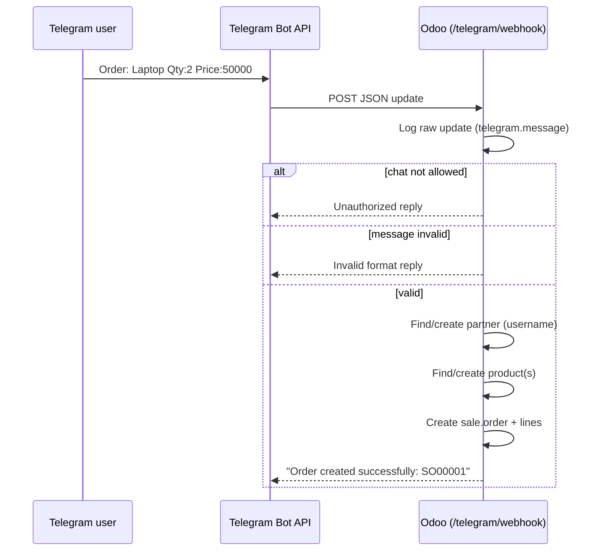

# Telegram Odoo Integration

A production-ready custom Odoo module that connects a **Telegram bot webhook**
to Odoo and automatically creates **Sales Orders** from chat messages.

Compatible with **Odoo 19 Community Edition** (also runs on Odoo 16 / 17 by
switching the version prefix to `16.0.x` / `17.0.x`).

> **Version prefix:** Odoo marks a module `uninstallable` when its manifest
> `version` does not start with the running Odoo major version. This module is
> shipped as `19.0.1.0.0` for Odoo 19. On other majors, align the prefix in
> `__manifest__.py`: Odoo 19 → `19.0.1.0.0`, Odoo 17 → `17.0.1.0.0`,
> Odoo 16 → `16.0.1.0.0`.

---

## Features

- Public JSON webhook endpoint: `POST /telegram/webhook`
- Configurable bot token + allowed chat id (Settings → Telegram)
- Automatic customer (`res.partner`) lookup/creation from the Telegram username
- Order message parser: `Order: Product Qty:2 Price:100`
  - Multiple products per message (comma or newline separated)
  - Case-insensitive `Order` / `Qty` / `Price` keywords
  - Decimal quantities and prices supported
- Automatic product lookup/creation with list price
- Draft Sales Order + lines creation
- Reply to the user through the Telegram Bot API (`sendMessage`)
- Full Telegram chat history in `telegram.message` with a dedicated
  **Sales ▸ Orders ▸ Telegram Orders** menu and a stat button on the Sales
  Order form
- Fail-closed security: only the configured chat id is processed
- Audit logging and JSON error responses

---

## Module structure

```
telegram_odoo_integration/
├── __init__.py
├── __manifest__.py
├── controllers/
│   ├── __init__.py
│   └── main.py                 # POST /telegram/webhook
├── models/
│   ├── __init__.py
│   ├── telegram_parser.py      # pure-Python order message parser
│   ├── telegram_message.py     # chat history model
│   ├── telegram_bot_service.py # business logic (partner/product/order)
│   ├── res_partner.py          # telegram fields on res.partner
│   ├── res_config_settings.py  # settings fields
│   └── sale_order.py           # stat count on sale.order
├── security/
│   └── ir.model.access.csv
├── views/
│   ├── res_config_settings_views.xml
│   ├── telegram_message_views.xml
│   └── sale_order_views.xml
├── tests/
│   ├── __init__.py
│   ├── test_telegram_parser.py
│   └── test_telegram_bot_service.py
└── static/description/index.html
```

---

## Installation

1. Copy the `telegram_odoo_integration` folder into your addons path
   (e.g. `custom_addons/`).
2. Update the addons path if needed (`--addons-path` or `addons_path` in
   `odoo.conf`).
3. Restart Odoo, then install the module:
   - **UI:** Apps ▸ Update Apps List, then search *Telegram Odoo Integration*.
   - **CLI:**
     ```bash
     ./odoo-bin -d <db> -i telegram_odoo_integration --stop-after-init
     ```

---

## Configuration (Odoo)

Open **Settings ▸ Telegram** and set:

| Setting          | Description                                                          |
|------------------|----------------------------------------------------------------------|
| Bot Token        | Token from `@BotFather` (e.g. `123456789:AAF...`)                    |
| Allowed Chat ID  | Chat id allowed to place orders. Get it from `@userinfobot`.         |

> Security is **fail-closed**: if *Allowed Chat ID* is empty, every request is
> rejected. The token is stored as an `ir.config_parameter`
> (`telegram_odoo_integration.bot_token`).

### Creating the bot & getting the chat id

1. Message `@BotFather` on Telegram → `/newbot` → copy the token.
2. Message `@userinfobot` → note your numeric chat id.
3. Fill both values in Settings ▸ Telegram and save.

---

## Setup the webhook (ngrok + Telegram)

Odoo's webhook endpoint requires HTTPS, so use **ngrok** to expose it:

```bash
# 1. Run Odoo (example: HTTP on port 8069)
./odoo-bin -c odoo.conf

# 2. Expose the local port with ngrok
ngrok http 8069
# Copy the https URL, e.g. https://abcd-123.ngrok-free.app

# 3. Tell Telegram where the webhook is
curl -F "url=https://abcd-123.ngrok-free.app/telegram/webhook" \
     "https://api.telegram.org/bot<BOT_TOKEN>/setWebhook"

# 4. Verify
curl "https://api.telegram.org/bot<BOT_TOKEN>/getWebhookInfo"
```

**Expected JSON payload** (Telegram → Odoo):

```json
{
  "update_id": 123456789,
  "message": {
    "chat": {"id": 111222333, "type": "private"},
    "from": {"id": 111222333, "username": "john_doe", "first_name": "John"},
    "text": "Order: Laptop Qty:2 Price:50000"
  }
}
```

---

## Usage (in Telegram)

Send to your bot:

```
Order: Laptop Qty:2 Price:50000
```

The bot replies: `Order created successfully: SO00001`

Multiple products:

```
Order: Laptop Qty:1 Price:50000, Mouse Qty:2 Price:300
```

or on separate lines:

```
Order: Laptop Qty:1 Price:50000
Mouse Qty:2 Price:300
```

Invalid messages get: `Invalid format. Use: Order: Product Qty:2 Price:100`

> Note: several products on the **same** line must be comma-separated, so a
> product name must not contain a comma in that case. Product names with
> commas can be sent one per line.

---

## How it works



1. Odoo always stores the raw update in `telegram.message` (audit trail).
2. The chat id is checked against `Allowed Chat ID` (fail-closed).
3. The message is parsed; the customer and products are created if missing.
4. A draft `sale.order` (with lines) is created.
5. The user is notified via the Telegram `sendMessage` API.

### Taxes

Order lines are created **without forcing taxes** — Odoo applies its own tax
configuration:

- **Odoo 16/17:** the line inherits the product's default taxes. Products
  created by the bot have no taxes, so orders are tax-free unless you configure
  taxes on the products (or the partner's fiscal position).
- **Odoo 19:** the new tax model applies the company default sale tax
  (`account_sale_tax_id`) automatically, so `amount_total` may include the
  configured default tax even for new products.

---

## Security notes

- The webhook route is `auth='public'`, `csrf=False` by design (server-to-server
  push). Access control is enforced by the **Allowed Chat ID** check.
- All ORM writes use explicitly scoped `sudo()` because they run in the public
  context — never on the web session user.
- Internal users see `telegram.message` read-only; Sales Managers can edit.
  The menu is visible to `sales_team.group_sale_salesman` and above.
- Keep the bot token private; it is stored as an `ir.config_parameter`.

---

## Running the tests

```bash
./odoo-bin -d <db> -i telegram_odoo_integration --test-enable \
    --test-tags /telegram_odoo_integration --stop-after-init
```

Tests cover the message parser and the full service flow
(partner/product/order creation, unauthorized rejection, invalid format reply,
partner reuse). The Telegram HTTP call is mocked.
